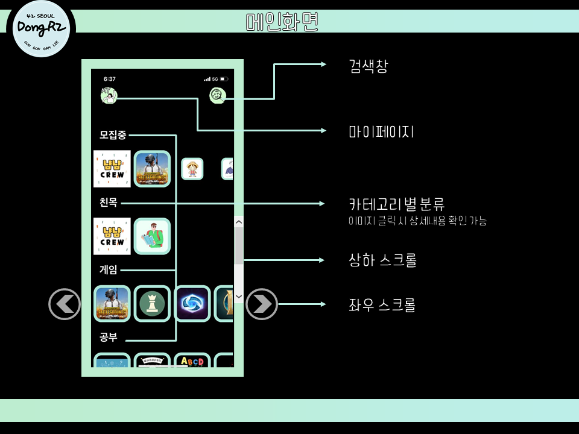
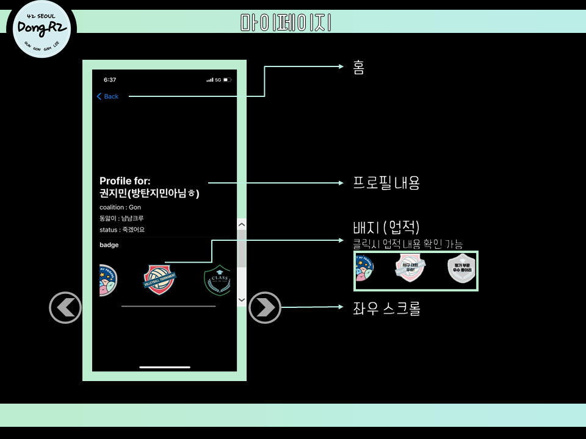
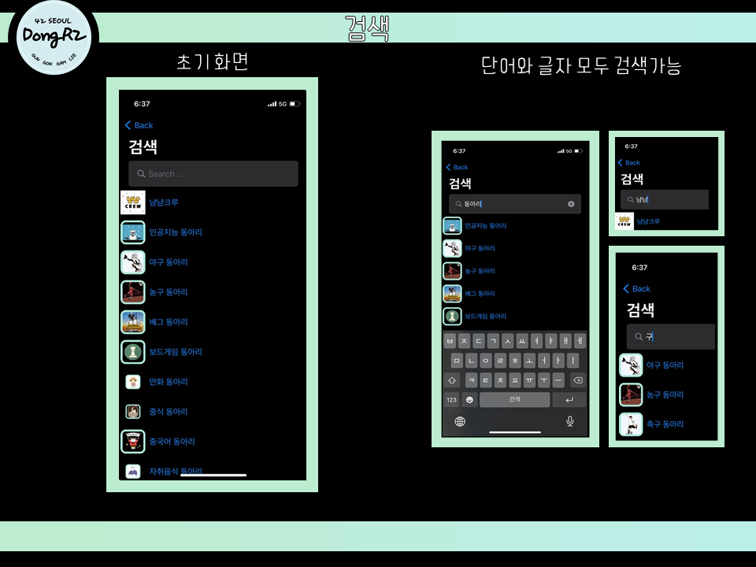
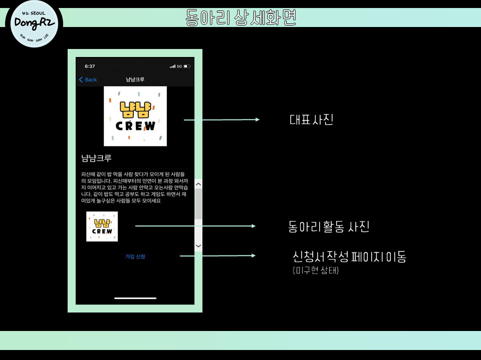

# 2020 42_Hackerthon
> 기간 : 2020.12.16 ~ 2020.12.18  
> 개발 환경 : MacOS catalina 10.15.4  
> IDE : Xcode  
> 언어 : swift  
> 개발자 : jimkwon, sehan, wopark

## 42 동아리 어플리케이션 제작
+ idea (서비스명 및 concept)
  + 서비스 명: 동앓이(DongR2)
  + concept :  42 동아리를 들고싶어 앓고있는 42인들을 위한 어플리케이션
+ Background (배경)
  + 동아리에 대한 접근성 및 정보 부족
  + 일시적으로 홍보가 몰리는 시기 외에 상시적으로 동아리 현황을 보기 힘듬
  + 동아리 활성화 방안 모색
+ Details
  + Target : 
    + Piciner를 막 벗어나 본과정에 들어온 cadet
    + 동아리에 들고 싶지만 정보가 부족해 망설이는 기존 cadet
    + 새로운 동아리원들을 모집하고 싶은 동아리
+ Benefits
  + 동아리 홍보 및 활성화
  + 동아리 활성화로 인한 동아리 발전 및 세분화
  + 프로젝트 외적으로 cadet들의 발전

 2020.12.18 updated 

### 1. 기능
**동앓이 시연 영상(이미지 클릭)**  

  
  
  
  
  
  
### 2. 보완해야할 점  
  

